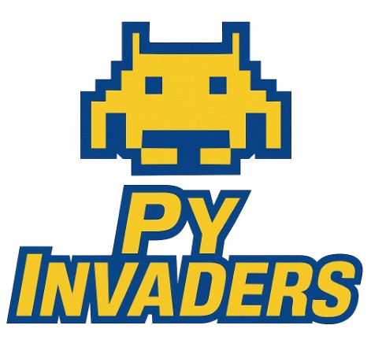

# Space Invaders - Pygame

 </strong> 

Um jogo estilo *Space Invaders* feito com Python e Pygame. Controle a nave, destrua os alienígenas e tente sobreviver ao máximo!    

## 🛠️ Requisitos

- 
- 

Instale o Pygame com:

    pip install pygame
    pipx install pygame # py via homebrew

## 🎮 Como Jogar

         ./run.sh 

- Use as **setas esquerda e direita** para mover a nave.
- Utilize a **barra de espaço** para atirar.
- Não tome tiros dos aliens e exploda todos para vencer.
- Você começa com 3 vidas, quando todas forem perdidas, o jogo acaba.

 <strong>🚀👾 Divirta-se jogando! 👾🚀</strong> 

## 🧠 Mecânicas

- Os alienígenas se movem horizontalmente e descem quando chegam nas extremidades.
- Eles também disparam tiros em em você.
- Se um alienígena for atingido, ele explode e você ganha pontos.
- Se todos os alienígenas forem eliminados, você vence.

## 📁 Estrutura de Arquivos
    ├── main.py
    ├── img/
    │ ├── background.jpg
    │ ├── player.png
    │ ├── alien.png
    │ ├── explosion.png
    │ ├── bullet.png
    │ ├── bullet_alien.png
    │ └── heart.png
    ├── som/
    │ ├── shot.wav
    │ ├── explosion.wav
    │ ├── win.wav
    │ └── dead.wav
    └── README.md

## 📌 Dicas
 - Os sons e imagens devem estar nas pastas img/ e som/, respectivamente.

- Você pode ajustar a dificuldade alterando a variável difficulty no início do código.

        # Constantes
        difficulty = 1 # 1: fácil, 2: médio, 3: difícil

## 📋 To Do
- Menu com seletor de dificuldade.
- Restart ao final d partidade.
- Progressao de level.
- Power-ups (escudo, tiro triplo, vida extra).
- Diferentes tipos de inimigos.
- Salva score em um arquivo para ranking local e mostra em scoreboard.
- Reorganização geral do codigo

## 🪪 Licença
Todos os sons foram retirados de https://freesound.org e são livres de copyright.

## 🧑‍💻 Autor
luis Fernando Neu

[![LinkedIn](https://img.shields.io/badge/LuisNeu-gray.svg?logo=data:image/svg%2bxml;base64,PHN2ZyBoZWlnaHQ9IjgwMHB4IiB3aWR0aD0iODAwcHgiIHZlcnNpb249IjEuMSIgaWQ9IkxheWVyXzEiIHhtbG5zPSJodHRwOi8vd3d3LnczLm9yZy8yMDAwL3N2ZyIgeG1sbnM6eGxpbms9Imh0dHA6Ly93d3cudzMub3JnLzE5OTkveGxpbmsiIAoJIHZpZXdCb3g9IjAgMCAzODIgMzgyIiB4bWw6c3BhY2U9InByZXNlcnZlIj4KPHBhdGggc3R5bGU9ImZpbGw6IzAwNzdCNzsiIGQ9Ik0zNDcuNDQ1LDBIMzQuNTU1QzE1LjQ3MSwwLDAsMTUuNDcxLDAsMzQuNTU1djMxMi44ODlDMCwzNjYuNTI5LDE1LjQ3MSwzODIsMzQuNTU1LDM4MmgzMTIuODg5CglDMzY2LjUyOSwzODIsMzgyLDM2Ni41MjksMzgyLDM0Ny40NDRWMzQuNTU1QzM4MiwxNS40NzEsMzY2LjUyOSwwLDM0Ny40NDUsMHogTTExOC4yMDcsMzI5Ljg0NGMwLDUuNTU0LTQuNTAyLDEwLjA1Ni0xMC4wNTYsMTAuMDU2CglINjUuMzQ1Yy01LjU1NCwwLTEwLjA1Ni00LjUwMi0xMC4wNTYtMTAuMDU2VjE1MC40MDNjMC01LjU1NCw0LjUwMi0xMC4wNTYsMTAuMDU2LTEwLjA1Nmg0Mi44MDYKCWM1LjU1NCwwLDEwLjA1Niw0LjUwMiwxMC4wNTYsMTAuMDU2VjMyOS44NDR6IE04Ni43NDgsMTIzLjQzMmMtMjIuNDU5LDAtNDAuNjY2LTE4LjIwNy00MC42NjYtNDAuNjY2UzY0LjI4OSw0Mi4xLDg2Ljc0OCw0Mi4xCglzNDAuNjY2LDE4LjIwNyw0MC42NjYsNDAuNjY2UzEwOS4yMDgsMTIzLjQzMiw4Ni43NDgsMTIzLjQzMnogTTM0MS45MSwzMzAuNjU0YzAsNS4xMDYtNC4xNCw5LjI0Ni05LjI0Niw5LjI0NkgyODYuNzMKCWMtNS4xMDYsMC05LjI0Ni00LjE0LTkuMjQ2LTkuMjQ2di04NC4xNjhjMC0xMi41NTYsMy42ODMtNTUuMDIxLTMyLjgxMy01NS4wMjFjLTI4LjMwOSwwLTM0LjA1MSwyOS4wNjYtMzUuMjA0LDQyLjExdjk3LjA3OQoJYzAsNS4xMDYtNC4xMzksOS4yNDYtOS4yNDYsOS4yNDZoLTQ0LjQyNmMtNS4xMDYsMC05LjI0Ni00LjE0LTkuMjQ2LTkuMjQ2VjE0OS41OTNjMC01LjEwNiw0LjE0LTkuMjQ2LDkuMjQ2LTkuMjQ2aDQ0LjQyNgoJYzUuMTA2LDAsOS4yNDYsNC4xNCw5LjI0Niw5LjI0NnYxNS42NTVjMTAuNDk3LTE1Ljc1MywyNi4wOTctMjcuOTEyLDU5LjMxMi0yNy45MTJjNzMuNTUyLDAsNzMuMTMxLDY4LjcxNiw3My4xMzEsMTA2LjQ3MgoJTDM0MS45MSwzMzAuNjU0TDM0MS45MSwzMzAuNjU0eiIvPgo8L3N2Zz4=)](https://www.linkedin.com/in/LuisNeu)
